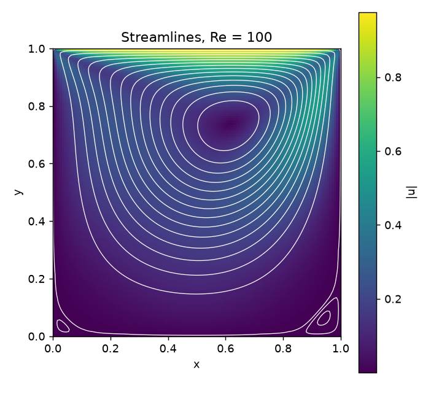
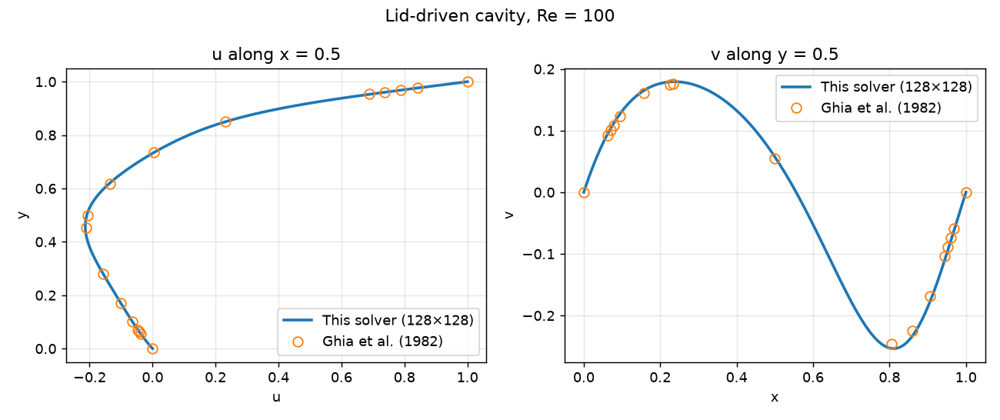

# Lid-Driven Cavity: Incompressible Navier–Stokes Solver

[](https://github.com/cfdgasman/lid-driven-cavity/actions/workflows/ci.yml)

A small, readable 2D incompressible Navier–Stokes solver in Python/NumPy for the classic **lid-driven cavity** benchmark. It is validated against **Ghia, Ghia & Shin (1982)**.

<p align="center"></p>

## Method

| | |
|---|---|
| Equations | 2D incompressible Navier–Stokes, ρ = 1, ν = U L / Re |
| Spatial discretisation | Finite volume on a **staggered (MAC) grid**: u, v on faces, p at cell centres |
| Convection / diffusion | Second-order central, conservative flux form |
| Pressure–velocity coupling | **Chorin projection**: explicit momentum predictor, then a pressure Poisson equation, then a velocity correction |
| Pressure Poisson | Pure-Neumann 5-point Laplacian with one value pinned, factorised once with sparse LU (`scipy.sparse.linalg.splu`) |
| Boundary conditions | No-slip walls and a moving lid (u = 1), imposed through ghost cells |
| Time step | min(0.25 h²/ν, h/U) × 0.8, run to steady state with max\|Δu\|/Δt < 10⁻⁶ |

Because of the staggered arrangement, the projected velocity field is **discretely divergence-free** to machine precision (max |∇·u| ≈ 6 × 10⁻¹⁴). Pressure checkerboarding cannot occur, so no Rhie–Chow interpolation is needed.

## Results

### Validation against Ghia et al. (1982), Re = 100

<p align="center"></p>

### Grid refinement

| Grid | max \|u − u<sub>Ghia</sub>\| | max \|v − v<sub>Ghia</sub>\| | ψ<sub>min</sub> |
|---|---|---|---|
| 16 × 16 | 0.0188 | 0.0139 | −0.098672 |
| 32 × 32 | 0.0020 | 0.0084 | −0.102129 |
| 64 × 64 | 0.0038 | 0.0086 | −0.103179 |
| 128 × 128 | 0.0049 | 0.0091 | −0.103435 |

- **Observed order of accuracy** (ψ<sub>min</sub>, N = 32/64/128): **2.04**, which matches the formal second order of the scheme.
- **Richardson-extrapolated ψ<sub>min</sub> = −0.103517**, against −0.103423 from Ghia et al. That is a **0.09 %** difference.
- The pointwise difference from Ghia stops shrinking at about 0.5–0.9 % of the lid speed. That is roughly the accuracy of the tabulated reference data (a 129 × 129 grid) plus the linear interpolation to its points, not a solver error.

The 128 × 128 run takes about 1 minute on a laptop.

## Usage

```bash
pip install -r requirements.txt
python run.py --n 128            # solve, print errors, write figures to docs/
python run.py --n 128 --study    # also run the grid-refinement study
pytest                           # convergence, divergence-free and Ghia checks
```

```python
from cavity import solve
r = solve(n=64, re=100)
y, u = r.centreline_u()
```

## Project layout

```
cavity/solver.py   MAC-grid projection solver
cavity/ghia.py     Ghia et al. (1982) reference data, Re = 100
run.py             validation figures and grid study
tests/             pytest checks, run in CI
```

## Reference

U. Ghia, K. N. Ghia, C. T. Shin, *High-Re solutions for incompressible flow using the Navier–Stokes equations and a multigrid method*, J. Comput. Phys. **48** (1982) 387–411.

## License

MIT
